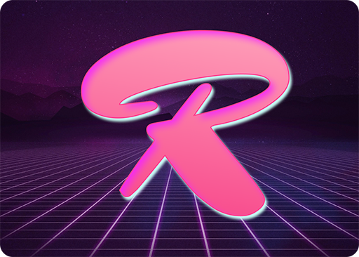
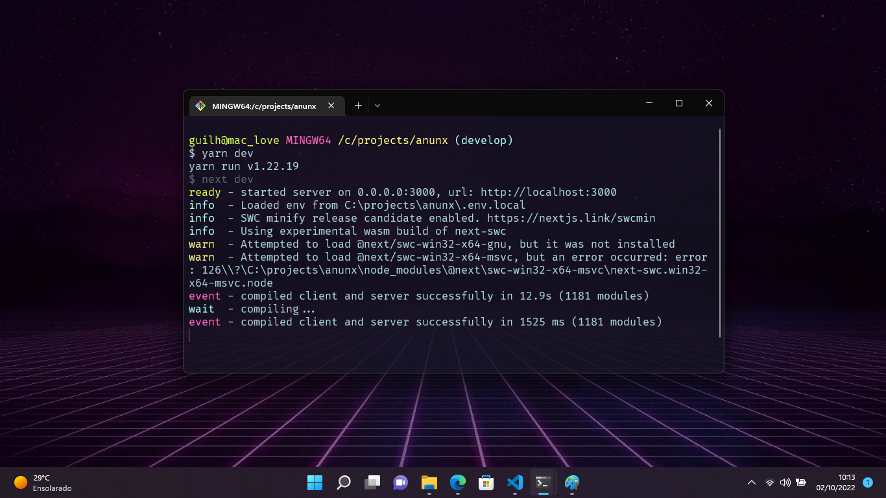
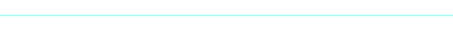

<h1 align="center">
   
  
   
  Radical for <a href="https://www.microsoft.com/pt-br/p/windows-terminal/9n0dx20hk701">Windows Terminal</a>
   
</h1>

  <strong>Dark theme for <a href="https://www.microsoft.com/pt-br/p/windows-terminal/9n0dx20hk701">Windows Terminal</a></strong>

  
  
  
  

  <a href="#install">Install</a> •
  <a href="#team">Team</a> •
  <a href="#license">License</a>

  

## About

This theme was built using the <a href="https://github.com/DHedgecock/radical-vscode">radical-vscode</a> theme style as a base.

## Install

All instructions can be found at [INSTALL.md](./INSTALL.md).

## Terminal Colors

  
  

## Team

This theme is maintained by the following person(s) and a bunch of [awesome contributors](https://github.com/guilhermelim/radical-windows-terminal/graphs/contributors).

|  |
| -------------------------------------------------------------------------------------------------- |
| [Guilherme Lima](https://github.com/guilhermelim)                                                  |

## License

[MIT License](./LICENSE.md)

   
   
  
  <h3>
    <strong>
      🙌 Thanks 💖
    </strong>
  </h3>

- The icon background is from Nate Wren's hecka rad
  [Rad Pack 80s Themed Wallpapers](https://natewren.com/rad-pack-80s-themed-hd-wallpapers/)
- The desktop background in the first screenshot is by
  [John Fowler on Unsplash](https://unsplash.com/photos/RsRTIofe0HE)

 
 

  

